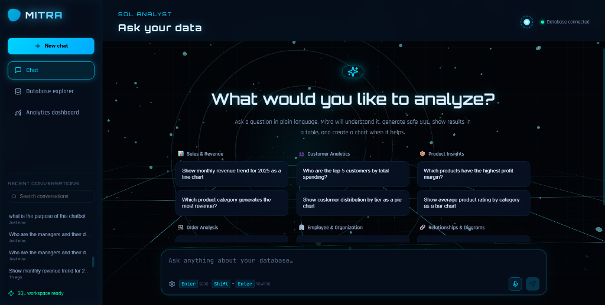
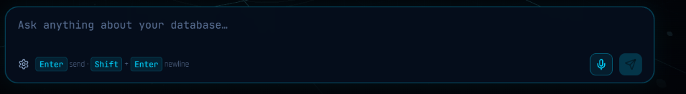
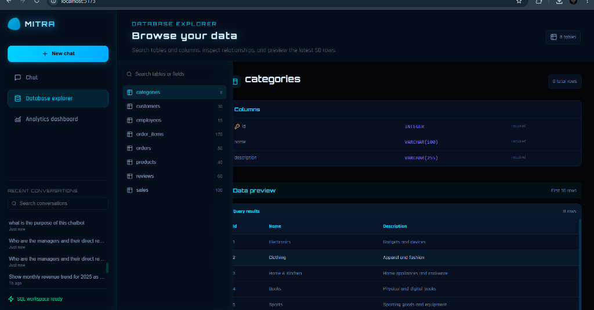
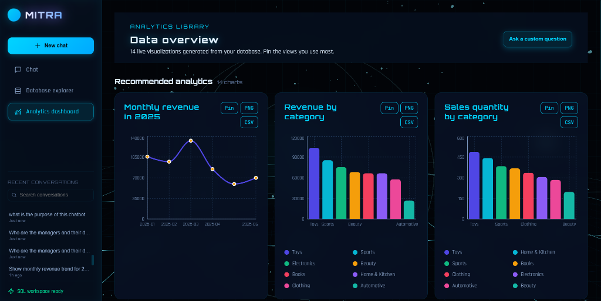
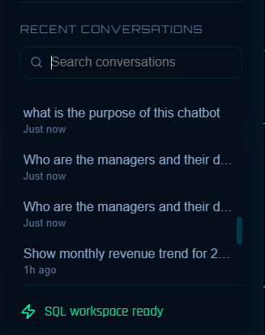
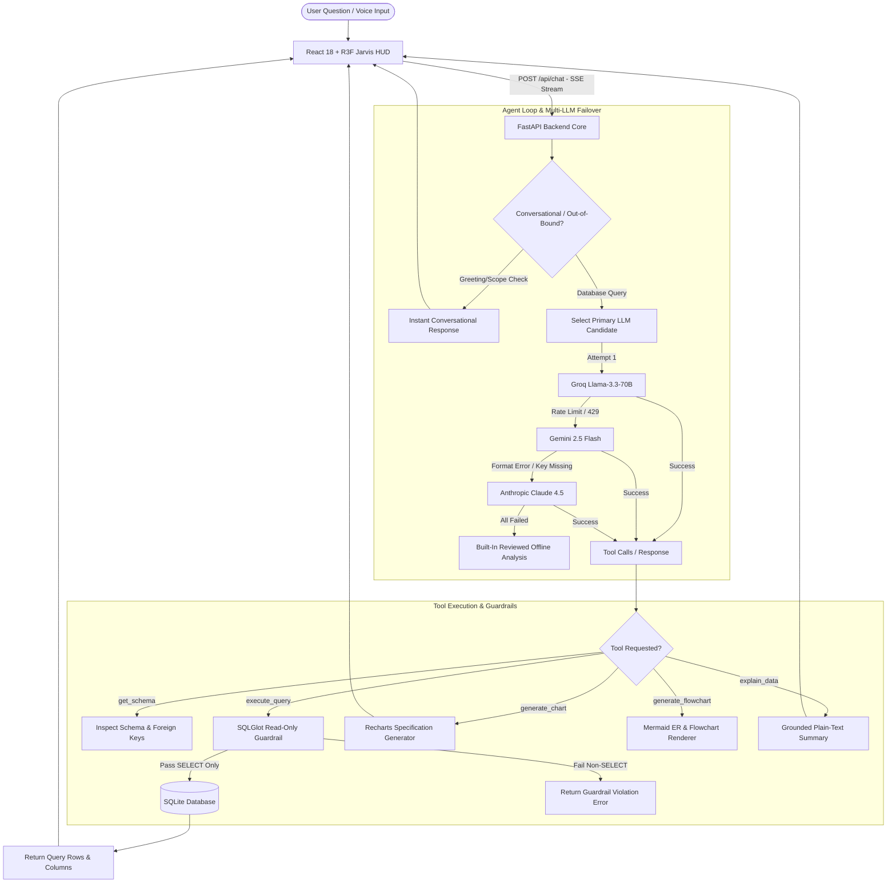

# 🤖 Mitra — Iron Man Jarvis-Style AI Database Analyst

[](https://github.com/kishorekumar-2512/Mitra)
[](https://github.com/kishorekumar-2512/Mitra)
[](https://github.com/kishorekumar-2512/Mitra)

**Mitra** is a high-performance, local-first natural language AI Database Analyst featuring a **futuristic 3D Jarvis-style UI/UX (Iron Man HUD aesthetic)**. Ask database questions in plain English or via voice, and watch Mitra execute safe read-only SQL, stream reasoning steps via Server-Sent Events (SSE), render dynamic interactive charts, and provide comprehensive database exploration.

---

## 🎬 Application Video Demo & Visual Showcase

### 🔴 Complete Application Demonstration Video
https://github.com/user-attachments/assets/demo-video.mp4

<p align="center">
  <video src="assets/demo-video.mp4" controls width="100%" poster="assets/chat-interface.png">
    Your browser does not support HTML5 video. You can view the video file directly at <a href="assets/demo-video.mp4">assets/demo-video.mp4</a>.
  </video>
</p>

---

### 📸 Application Interface Screenshots

#### 1. 🌌 Jarvis 3D HUD Chat Interface & Live SSE Streaming

*Features a 3D neural constellation background, rotating energy rings, infinite holographic grid floor, arc-reactor `JarvisOrb`, real-time scanline thinking indicators, and streaming SQL execution.*

---

#### 2. 🎙️ Voice Dictation Engine & Waveforms

*Microphone input bar with glowing visualizer, keyboard shortcuts (`Enter` send, `Shift` + `Enter` newline), provider settings toggle, and dual-engine voice transcription.*

---

#### 3. 🔍 Searchable Database Explorer & Schema Inspector

*Interactive schema inspection, foreign key mapping, column data-type badges, search filtering, and instant 50-row table previews.*

---

#### 4. 📊 Real-Time Analytics Dashboard

*Curated library of live data-backed Recharts visual cards (Line, Bar, Pie) with PNG export, CSV download, and interactive pinning.*

---

#### 5. 💬 Sidebar & Conversation History

*Searchable 7-day conversation history, quick workspace status monitors, and one-click thread navigation.*

---

## 🔄 Agent & Pipeline Architecture



---

## ⚡ Multi-LLM Failover Engine & API Compatibility

Mitra features an **agentic tool-calling loop** with intelligent failover across multiple state-of-the-art LLM providers:

1. **Groq (`llama-3.3-70b-versatile`)**: Ultra-fast tool-calling inference.
2. **Google Gemini (`gemini-2.5-flash`)**: High-throughput reasoning fallback with custom recursive JSON Schema sanitizer that strips unsupported keywords (`$defs`, `title`, `default`, `anyOf`).
3. **Anthropic Claude (`claude-sonnet-4-5`)**: Precision analytical reasoning.
4. **Deterministic Offline Fallback**: If upstream provider quotas or keys are exhausted, Mitra safely runs built-in read-only analytical queries without inventing or fabricating answers.

---

## 🛡️ SQL Security & Read-Only Guardrails

Safety is built into the parser level:
- **AST Parsing**: Powered by `sqlglot` to parse incoming SQL into Abstract Syntax Trees.
- **Strict Read-Only Enforcement**: Any query containing `DROP`, `DELETE`, `UPDATE`, `INSERT`, `ALTER`, or multi-statement execution is instantly rejected before reaching the database.
- **Result Row Truncation**: Capped at 500 rows to prevent memory exhaustion and browser freeze.

---

## 🚀 The Jarvis 3D HUD UI/UX Experience

- **🌌 3D Neural Constellation & Floor Grid**: Built with Three.js / React Three Fiber featuring 600 drifting instanced particles, concentric torus energy rings, and an infinite floor grid.
- **🔮 Interactive `JarvisOrb`**: Arc-reactor glowing core in the chat header that accelerates rotation and pulses with energy during agent execution.
- **💎 Glassmorphism & Neon Cyan Palette**: Dark void theme (`#020408`) overlaid with frosted glass panels (`backdrop-filter: blur(24px)`), electric blue borders, and neon cyan accents.
- **🎙️ HUD Audio Visualizer**: Microphone button with pulsating ripple animations and live audio waveform bars during speech dictation.

---

## 💻 Tech Stack

- **Frontend**: React 18, Vite, TypeScript, Three.js, React Three Fiber, Recharts, Mermaid.js, Lucide Icons, Vanilla CSS.
- **Backend**: Python 3.12, FastAPI, SQLAlchemy, SQLGlot, AsyncHTTPX, Pydantic v2.
- **LLM Integrations**: Groq SDK, Anthropic SDK, Gemini REST API, Groq Whisper API.

---

## ⚙️ Setup & Installation

### 1. Environment Configuration (`.env`)
Create a `.env` file in the project root:

```env
GROQ_API_KEY=your_groq_api_key_here
GROQ_MODEL=llama-3.3-70b-versatile

GEMINI_API_KEY=your_gemini_api_key_here
GEMINI_MODEL=gemini-2.5-flash

ANTHROPIC_API_KEY=your_anthropic_api_key_here
CLAUDE_MODEL=claude-sonnet-4-5-20250929

DATABASE_URL=sqlite+aiosqlite:///./data/insightforge.db
REDIS_URL=redis://localhost:6379/0
VOICE_TRANSCRIPTION_MODEL=whisper-large-v3-turbo
```

### 2. Running Locally

#### 🐍 Backend (FastAPI)
```bash
cd backend
python -m venv .venv
source .venv/bin/activate  # On Windows: .venv\Scripts\activate
pip install -r requirements.txt
uvicorn app.main:app --reload --port 8000
```

#### ⚛️ Frontend (Vite + React)
```bash
cd frontend
npm install
npm run dev
```

Open `http://localhost:5173` to launch **Mitra**.

---

## 📜 License

Distributed under the MIT License. See `LICENSE` for more information.
