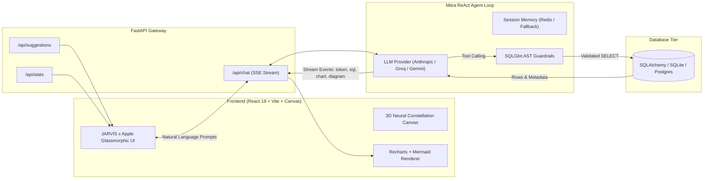

# Mitra 🚀 (Intelligent AI Database Agent & Visual Analytics Platform)

An enterprise-grade, cinematic **Text-to-SQL AI Agent & Analytics Platform** built for modern relational database interaction and interactive visual reporting. Powered by a **JARVIS × Apple cinematic design system**, Mitra translates natural language prompts into dialect-safe SQL, executes queries through AST security guardrails, streams real-time agent reasoning steps via Server-Sent Events (SSE), renders dynamic charts & Mermaid ER diagrams, and presents an expanded 8-table relational data ecosystem.

---

## 📋 Table of Contents
- [💡 About the Project](#-about-the-project)
- [🏗️ System Architecture](#%EF%B8%8F-system-architecture)
- [✨ Key Features](#-key-features)
- [⚙️ Prerequisites](#%EF%B8%8F-prerequisites)
- [🗄️ Database & Service Installation](#%EF%B8%8F-database--service-installation)
  - [Option A: Docker Setup (Recommended)](#option-a-docker-setup-recommended)
  - [Option B: Manual Local Setup](#option-b-manual-local-setup)
- [🐍 Backend Setup (FastAPI & Python)](#-backend-setup-fastapi--python)
- [💻 Frontend Setup (React, Vite & Canvas)](#-frontend-setup-react-vite--canvas)
- [☁️ Render Cloud Deployment](#%EF%B8%8F-render-cloud-deployment)
- [🔑 Environment Variables](#-environment-variables)
- [🔌 API Endpoints & Usage](#-api-endpoints--usage)
- [🔒 Security & Guardrails](#-security--guardrails)
- [❓ Troubleshooting](#-troubleshooting)

---

## 💡 About the Project

Traditional database interaction requires complex SQL syntax or long wait times for data engineering reports. **Mitra** bridges this gap by providing a secure, natural language interface to explore, analyze, and visualize complex relational databases.

### Key Architectural Highlights:
- 🧠 **Multi-Provider AI Brain**: Native integration with Anthropic Claude (Sonnet 4.5), Groq (Llama 3.1), and Google Gemini (3.6 Flash) with client-side or server-side key fallback.
- 🛠️ **Tool Registry & AST Guardrails**: Safely inspects database schemas (`get_schema`), executes validated SELECT queries (`execute_query`), synthesizes findings (`explain_data`), and generates dynamic charts (`generate_chart`) and ER diagrams (`generate_flowchart`).
- ⚡ **Real-Time SSE Streaming**: Stream reasoning tokens, SQL queries, interactive Recharts visualizations, and Mermaid flowchart definitions straight to the client with sub-second feedback.
- 🌌 **Cinematic JARVIS × Apple Experience**: Interactive 3D neural constellation canvas, fluid 8-point morphing AI orb, 3D perspective tilt cards, message materialization animations, and dynamic cursor energy field.
- 🗄️ **Rich E-Commerce Database Ecosystem**: Pre-seeded with 8 interconnected tables (Categories, Products, Customers, Orders, Order Items, Sales, Reviews, Employees) containing 483+ realistic records.

---

## 🏗️ System Architecture



---

## ✨ Key Features

- **Natural Language to SQL**: Converts intuitive prompts into optimized, dialect-specific SQL statements.
- **AST Parsing & Security Guardrails**: Uses `SQLGlot` to validate query structure, strictly allow `SELECT` statements, and block any illegal mutations (`DROP`, `UPDATE`, `INSERT`, `DELETE`).
- **8-Table Relational Schema**: 
  - `categories`: Product category hierarchy.
  - `products`: Items with prices, unit costs, inventory stock, and ratings.
  - `customers`: Global customer profiles with tier classifications (`Gold`, `Silver`, `Bronze`).
  - `orders`: Order tracking with statuses (`completed`, `shipped`, `pending`, `cancelled`) and payment methods.
  - `order_items`: Transaction line items with unit pricing and discount rates.
  - `sales`: Daily aggregated revenue performance metrics.
  - `reviews`: Customer product reviews (ratings 1–5).
  - `employees`: Organization staff data with salaries and manager hierarchy.
- **Categorized Query Suggestions**: Offers 25+ pre-built natural language queries grouped across 6 domains (Sales & Revenue, Customer Analytics, Product Insights, Order Analysis, Employee & Organization, Relationships & Diagrams).
- **Dynamic Charting & ER Flowcharts**: Generates Bar, Line, Pie, and Scatter charts via `Recharts` and produces live entity-relationship diagrams using `Mermaid.js`.
- **Bring Your Own Key (BYOK)**: Supports browser-level API key entry for Anthropic, Groq, or Gemini without logging or persisting credentials to storage.
- **JARVIS × Apple UI/UX**: Includes responsive glassmorphism, 3D particle constellation, morphing AI orb, cursor aura, and 3D card tilt effects.

---

## ⚙️ Prerequisites

Before running Mitra, ensure you have the following installed:

- **Python**: Version `3.11` or higher
- **Node.js**: Version `18.0` or higher (with `npm` v9+ or `pnpm`)
- **Docker & Docker Compose**: (Optional, recommended for zero-config startup)
- **API Key**: At least one API key from Anthropic, Groq, or Google Gemini AI Studio.

---

## 🗄️ Database & Service Installation

### Option A: Docker Setup (Recommended)

Run the full stack (FastAPI backend, React frontend, and Redis cache) using Docker Compose:

```bash
# Clone the repository
git clone https://github.com/kishorekumar-2512/Mitra.git
cd Mitra

# Start all services
docker-compose up --build -d
```

Access the UI at `http://localhost:5173` and backend health check at `http://localhost:8000/api/health`.

To stop the environment:
```bash
docker-compose down
```

---

### Option B: Manual Local Setup

#### 1. Redis Setup (Optional)
Redis is used for session memory and chart pinning. If Redis is unavailable, Mitra automatically falls back to an in-memory store.

- **Windows (WSL / Docker)**: `docker run -d -p 6379:6379 redis:7-alpine`
- **macOS**: `brew install redis && brew services start redis`
- **Linux**: `sudo apt install redis-server && sudo systemctl start redis-server`

---

## 🐍 Backend Setup (FastAPI & Python)

1. **Navigate to backend directory**:
   ```bash
   cd backend
   ```

2. **Activate existing environment or create a new one (`.venv`)**:
   - **Linux / WSL / macOS (Bash/Zsh)**:
     ```bash
     source .venv/bin/activate
     # Or if creating a new venv:
     # python3 -m venv .venv && source .venv/bin/activate
     ```
   - **Windows (PowerShell)**:
     ```powershell
     .\.venv\Scripts\activate
     # Or if creating a new venv:
     # python -m venv .venv && .\.venv\Scripts\activate
     ```

3. **Install Python dependencies**:
   ```bash
   pip install --upgrade pip
   pip install -r requirements.txt
   ```

4. **Set environment variables**:
   Copy `.env.example` to `.env` in the root or backend directory:
   ```bash
   cp .env.example .env
   ```
   Add your preferred API key (`GEMINI_API_KEY`, `ANTHROPIC_API_KEY`, or `GROQ_API_KEY`).

5. **Start the FastAPI Backend**:
   ```bash
   uvicorn app.main:app --reload --host 0.0.0.0 --port 8000
   ```

---

## 💻 Frontend Setup (React, Vite & Canvas)

1. **Navigate to frontend directory**:
   ```bash
   cd frontend
   ```

2. **Install Node dependencies**:
   ```bash
   npm install
   ```

3. **Start the Vite development server**:
   ```bash
   npm run dev
   ```

4. Open your browser and navigate to `http://localhost:5173`.

---

## ☁️ Render Cloud Deployment

Mitra can be deployed effortlessly using Docker or Render's web service platform:

1. Connect your GitHub repository (`kishorekumar-2512/Mitra`) to Render.
2. **Backend Web Service**:
   - Build Command: `pip install -r backend/requirements.txt`
   - Start Command: `uvicorn app.main:app --host 0.0.0.0 --port 8000`
   - Set environment variables (`GEMINI_API_KEY`, `CLAUDE_MODEL`, etc.).
3. **Frontend Static Site**:
   - Build Command: `cd frontend && npm install && npm run build`
   - Publish Directory: `frontend/dist`

---

## 🔑 Environment Variables

The backend application reads configuration from `.env`:

| Variable | Type | Default Value | Description |
|---|---|---|---|
| `ANTHROPIC_API_KEY` | String | `""` | Optional server-configured Anthropic API Key |
| `GROQ_API_KEY` | String | `""` | Optional server-configured Groq API Key |
| `GEMINI_API_KEY` | String | `""` | Optional server-configured Gemini API Key |
| `CLAUDE_MODEL` | String | `claude-sonnet-4-5-20250929` | Model ID for Anthropic provider |
| `GROQ_MODEL` | String | `llama-3.1-8b-instant` | Model ID for Groq provider |
| `GEMINI_MODEL` | String | `gemini-3.6-flash` | Model ID for Gemini provider |
| `DATABASE_URL` | String | `sqlite+aiosqlite:///./data/mitra.db` | SQLAlchemy async connection URL |
| `REDIS_URL` | String | `redis://localhost:6379/0` | Connection string for Redis session store |

---

## 🔌 API Endpoints & Usage

| Method | Endpoint | Description |
|---|---|---|
| `GET` | `/api/health` | Service status check (`{"status": "ok", "service": "mitra"}`) |
| `GET` | `/api/schema` | Returns full table schema and foreign key relationships |
| `GET` | `/api/suggestions` | Returns 25+ categorized natural language sample queries |
| `GET` | `/api/stats` | Returns real-time row counts for all database tables |
| `POST` | `/api/chat` | Server-Sent Events (SSE) stream for agent reasoning, SQL, charts & diagrams |
| `GET` | `/api/sessions/{id}` | Fetches conversation state and pinned chart dashboards |
| `POST` | `/api/sessions/{id}/pins` | Pins a chart configuration to the user's dashboard |
| `PUT` | `/api/sessions/{id}/pins` | Updates dashboard chart ordering |

---

## 🔒 Security & Guardrails

- **AST Validation**: `SQLGlot` parses generated SQL queries prior to execution to enforce strict `SELECT`-only permissions and eliminate multi-statement injection risks.
- **Read-Only Engine Isolation**: Database interactions execute within read-only transactions.
- **Client-Side Key Confidentiality**: User-supplied API keys in the settings modal are sent directly via request headers and are **never** logged or saved to Redis/disk.
- **Self-Correcting Loop**: When a database query fails syntax or execution check, Mitra automatically feeds the error trace back to the agent for a self-correction attempt.

---

## ❓ Troubleshooting

1. **Error: Missing API Key**
   - Ensure you have added at least one valid API key in `.env` or entered it into the frontend Settings modal.

2. **Error: Script execution disabled on Windows**
   - Run PowerShell commands with `-ExecutionPolicy Bypass`:
     ```powershell
     powershell -ExecutionPolicy Bypass -Command "npm run dev"
     ```

3. **Backend cannot find SQLite database**
   - SQLite database is generated automatically on first startup. Check that `backend/data` directory has write permissions.

---

*Made with React, TypeScript, FastAPI, SQLAlchemy, SQLGlot, and Recharts.*
